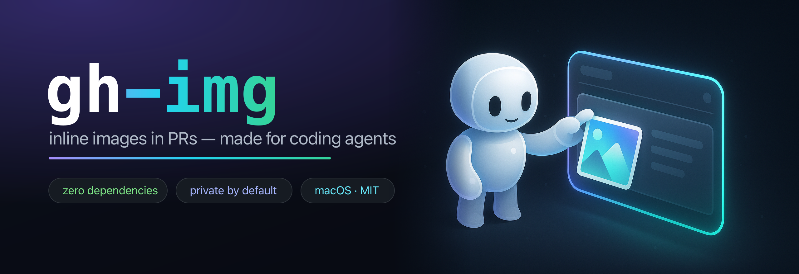

# gh-img



[](https://github.com/theolundqvist/gh-img/actions/workflows/ci.yml)
[](go.mod)
[](https://pkg.go.dev/github.com/theolundqvist/gh-img)
[](LICENSE)

**Made for coding agents.** Lets an AI agent (Claude Code, Cursor, and friends) paste images and screenshots straight into GitHub **PR descriptions and comments** — no human drag-drop. The agent runs `gh img screenshot.png`, gets back a `` markdown line, and drops it into the PR.

Because GitHub asset URLs inherit the repository's visibility, an image uploaded against a private repo **stays private** — it renders inline for anyone with repo access and 404s for everyone else.

- **Made for agents.** Ships with an [`AGENTS.md`](AGENTS.md) and a [Claude Code skill](skills/pr-screenshot); the output is one markdown line ready to paste into a PR body or comment.
- **Zero third-party dependencies.** Pure Go standard library — `go.mod` has no `require` block. The only externals are the macOS `security` and `sqlite3` binaries that already ship with the OS.
- **Safe and easily verifiable.** A few hundred lines you can read end-to-end in one sitting. The session cookie is used only against `github.com` and GitHub's own upload storage — never written to disk, never logged, never sent anywhere else.
- **Private by default.** Images inherit repo visibility; a private repo's screenshots 404 for anyone without access.
- **No unscoped cookie handed to a third party.** A clean-room reimplementation of the browser upload flow, so you aren't trusting someone else's package with a full-account session cookie.

## Demo

The image below was uploaded to this repo by `gh-img` itself and embedded by its `user-attachments` URL:


## Install

As a `gh` extension (recommended):

```sh
gh extension install theolundqvist/gh-img
gh img screenshot.png
```

Or with Go:

```sh
go install github.com/theolundqvist/gh-img/cmd/gh-img@latest
```

Or build from source:

```sh
git clone https://github.com/theolundqvist/gh-img && cd gh-img
go build -o gh-img ./cmd/gh-img
```

## Usage

```sh
# repo auto-detected from the git remote, session read from your browser
gh img screenshot.png

# explicit repo
gh img --repo owner/repo screenshot.png

# multiple images (one markdown line printed per image)
gh img a.png b.png c.png

# explicit session token — works on any OS, never touches the browser/Keychain
gh img --token <user_session value> --repo owner/repo screenshot.png
GH_SESSION_TOKEN=<value> gh img --repo owner/repo screenshot.png
```

Each upload prints one markdown line to stdout:

```

```

Errors go to stderr. With multiple images, `gh-img` continues on failure and exits non-zero if any image failed.

## Platform support

| Path | macOS | Linux / Windows |
|---|---|---|
| Read session from browser | ✅ Arc, Chrome, Brave, Edge, Chromium | ❌ |
| `--token` / `GH_SESSION_TOKEN` | ✅ | ✅ |

The upload flow is platform-independent; only reading the cookie out of the browser is macOS-only (it relies on the macOS Keychain). On Linux/Windows, pass the token explicitly.

## How it works

1. Reads the `user_session` cookie for `github.com` from your browser's cookie database and decrypts it with the key stored in the macOS Keychain (PBKDF2-HMAC-SHA1 → AES-128-CBC, the standard Chromium scheme).
2. Validates the session, then drives GitHub's own upload flow: fetch the repo page for an upload token, request an upload policy, `POST` the file to the returned signed storage URL, and confirm the asset.

This is a clean-room reimplementation of what the GitHub web UI does when you drag an image into a comment box — there is no public API for it.

## For agents

`gh-img` is built to be driven by a coding agent, and ships the pieces for it:

- [`AGENTS.md`](AGENTS.md) — usage notes an agent picks up automatically.
- [`skills/pr-screenshot`](skills/pr-screenshot) — a Claude Code skill that uploads image(s) and embeds them in the current PR (description or a comment). Install it with:

  ```sh
  cp -r skills/pr-screenshot ~/.claude/skills/
  ```

The agent runs `gh img <file>`, gets one `` line, and drops it into the PR.

## Security

`gh-img` reads your GitHub `user_session` browser cookie. **That cookie is an unscoped, full-account credential — treat it like your password.** It is used only to authenticate requests to `github.com` and GitHub's own upload storage endpoint; it is never written to disk, never logged, and never sent anywhere else. The temporary copy of the cookie database is created with `0600` permissions and deleted immediately after reading.

On first use per browser, macOS prompts for Keychain access to decrypt the cookie. That prompt is the security boundary — it is expected.

On shared or CI machines, supply the token explicitly via `--token` or `GH_SESSION_TOKEN` rather than letting the tool read the browser.

## Limitations

- Browser cookie reading is macOS + Chromium-family only. Firefox and Safari are not supported (use `--token`).
- Uses an undocumented GitHub upload endpoint; if GitHub changes it, the tool will need updating.
- Requires write access to the target repo (GitHub scopes the upload token to repos you can push to).

## Troubleshooting

- **macOS Keychain prompt on first run** — expected. macOS is asking permission to read the browser's cookie-encryption key. Click Allow.
- **`no valid GitHub session found`** — you're not logged into GitHub in a supported browser, or the cookie expired. Log in again, or pass `--token`.
- **`uploadToken not found ... SAML SSO`** — the org enforces SAML and your browser session isn't SSO-authorized. Authorize at `https://github.com/orgs/<org>/sso` (lasts ~24h), then retry. Write access alone isn't enough.
- **`fetch repo page: HTTP 404`** — you lack access to that repo, or `--repo owner/name` is wrong.
- **Firefox / Safari / Linux / Windows** — browser reading is unsupported; pass `--token <user_session>` or set `GH_SESSION_TOKEN`.

## License

MIT — see [LICENSE](LICENSE).
